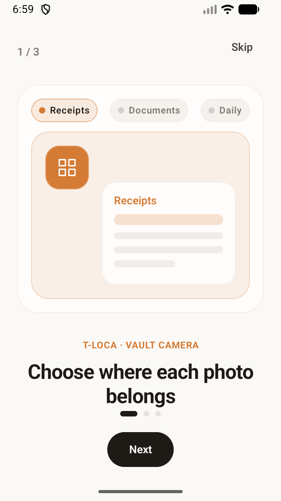
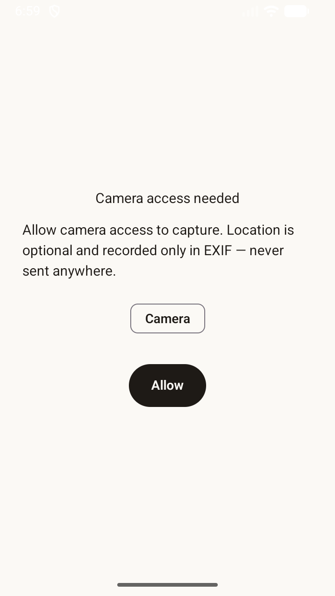
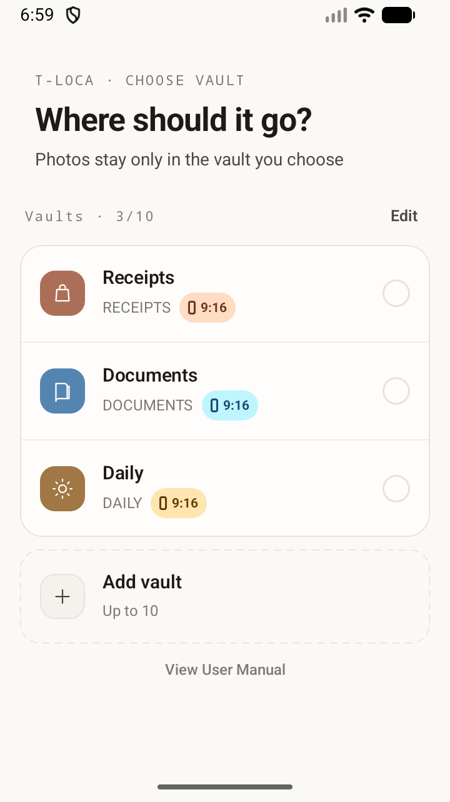
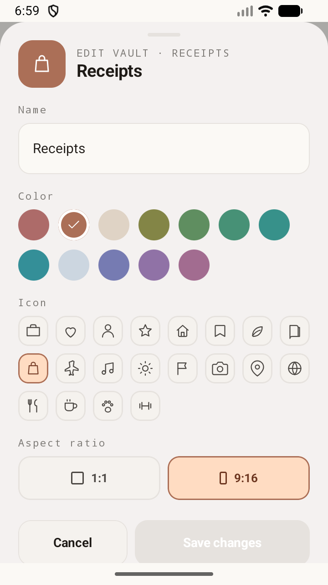
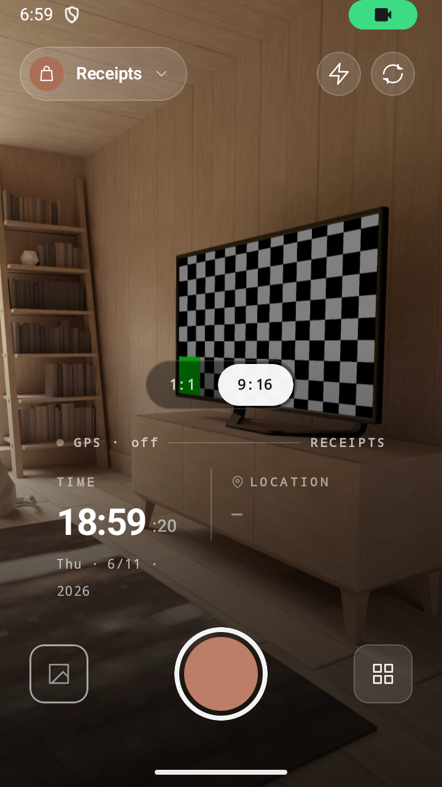
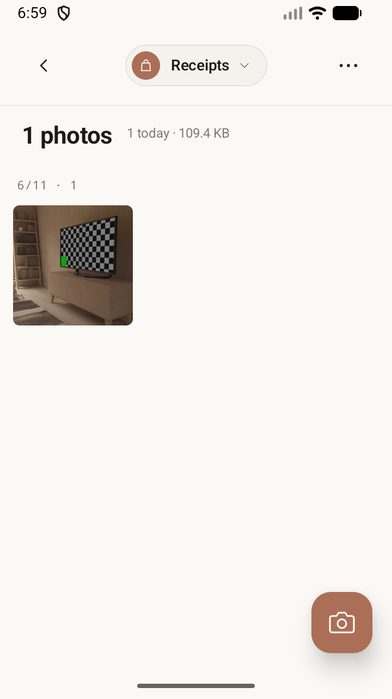
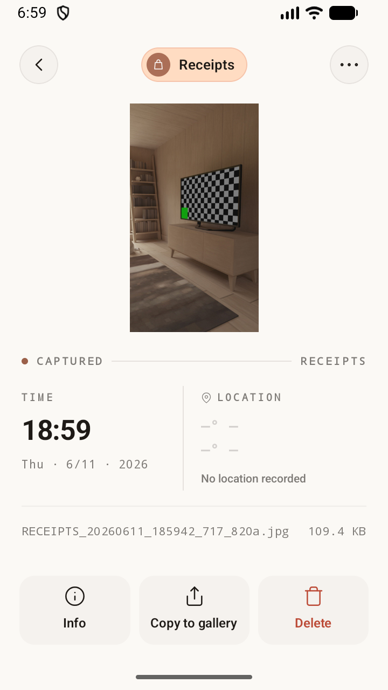
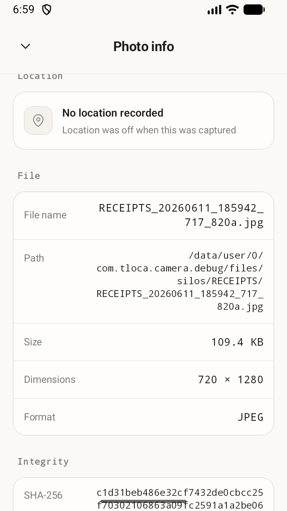
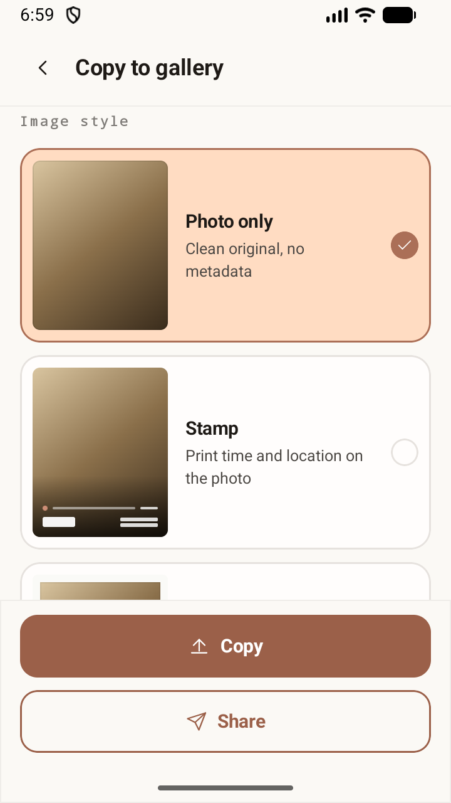
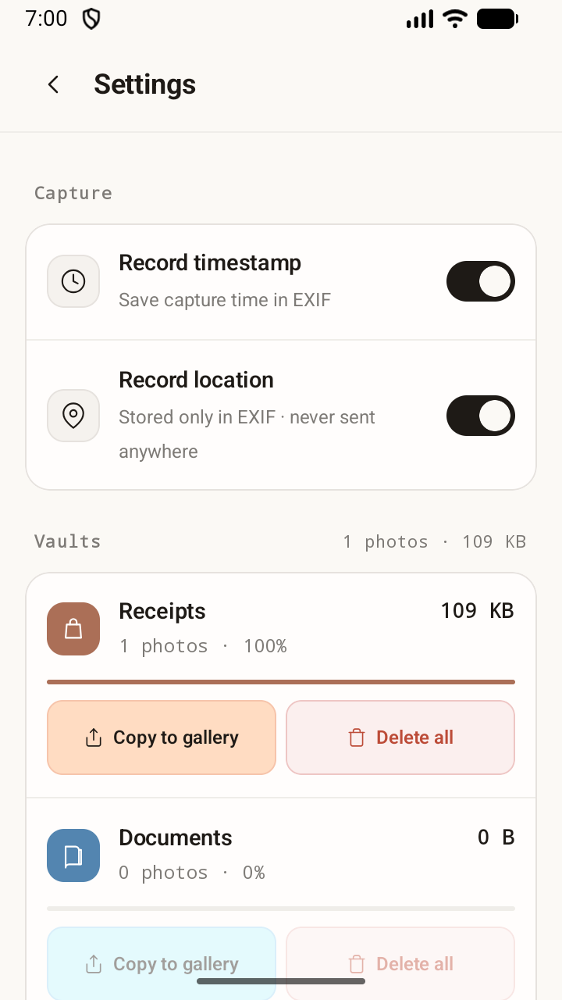

# T-Loca User Manual

Version: 0.1.2

T-Loca is a camera app where you choose a vault before taking a photo. Photos are saved only inside the selected vault and do not appear in your device gallery automatically.

## Getting Started

On first launch, T-Loca explains that photos are separated by vault, capture details and optional location can be stored as metadata, and photos stay inside the app until you export them.

Camera permission is required for capture. Location permission is optional; if granted, the capture location is recorded in photo info and EXIF. Location data is not transmitted externally.

## Selecting a Vault

Choose the vault where new photos should be saved. The default vaults are Receipts, Documents, and Daily. Tapping a vault opens the camera, and captured photos stay only in that vault.

## Creating and Editing Vaults

Tap Add vault on the vault picker to create a new vault. Quick-start chips let you create purpose-built vaults such as OOTD, Food, Cafe, Travel, Fitness, Pets, Selfie, Challenge, Daily, and Study.

You can configure the vault name, color, icon, and aspect ratio. T-Loca supports up to 10 vaults, and the final remaining vault cannot be deleted. Before deleting a vault, use Copy to gallery first if you want to keep its photos.

## Taking Photos

The camera saves directly to the selected vault. Use the shutter button to capture, and use flash, camera flip, 1:1 or 9:16 capture ratio, location recording, and tap-to-focus controls as needed.

## Gallery

The gallery shows only photos from the selected vault. Photos are grouped by date, and the header shows the total photo count and today's count.

## Photo Detail and Info

The photo detail screen lets you view the photo, delete it, copy it to the gallery, or open photo info. Deleted photos cannot be recovered.

Photo info shows capture date and time, time zone, coordinates and address, filename and internal path, file size, dimensions, format, SHA-256 hash, and hash computation time.

## Copy to Gallery and Share

T-Loca photos live only inside the app by default. To view them in other apps or include them in cloud backup, run Copy to gallery. Exported photos are saved to `DCIM/T-Loca`.

When copying, choose Photo only, Stamp, or Border style. You can also share photos, and enabling Include integrity info adds a banner with SHA-256 hash, location, and timestamp details.

## Settings

Settings lets you manage capture settings, internal storage usage, per-vault usage, vault-specific gallery copy, vault-specific deletion, copying all photos to the gallery, and deleting all data.

## Data Storage Caution

T-Loca stores photos inside app-private storage by default. Internal photos do not appear in your device gallery automatically, and uninstalling the app or clearing app data in Android settings may delete them. Copy important photos to the gallery first.

## Troubleshooting

If the camera does not open, allow camera permission in Android app settings. If location is not recorded, check location permission and the Record location setting. If photos do not appear in your device gallery, run Copy to gallery. If a low-storage warning appears, free device storage before capturing.
