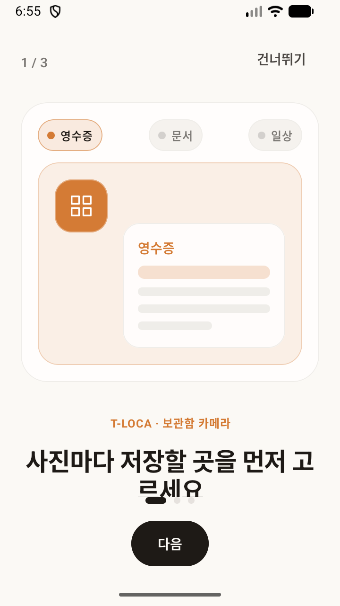
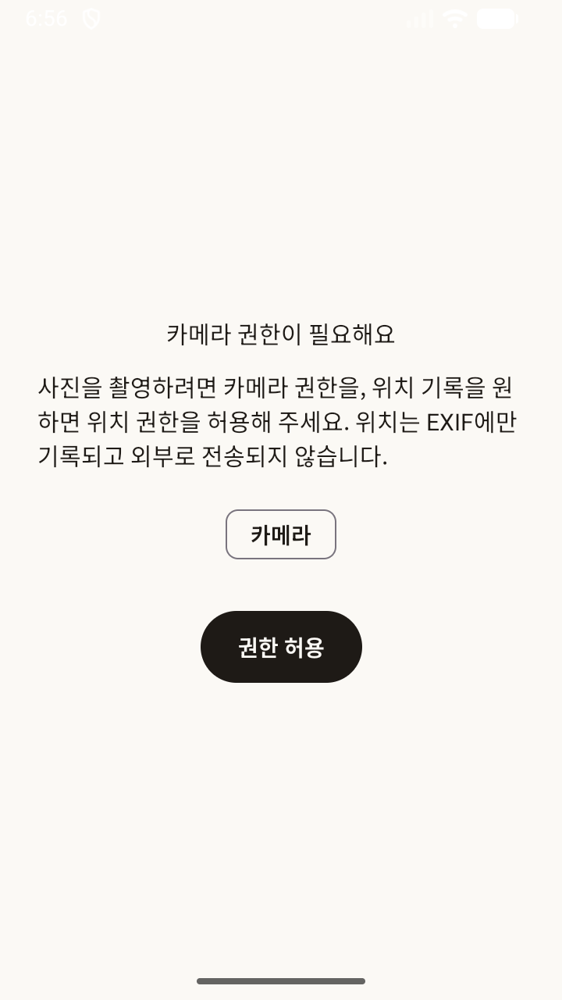
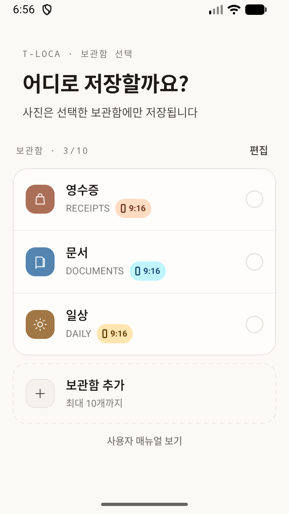
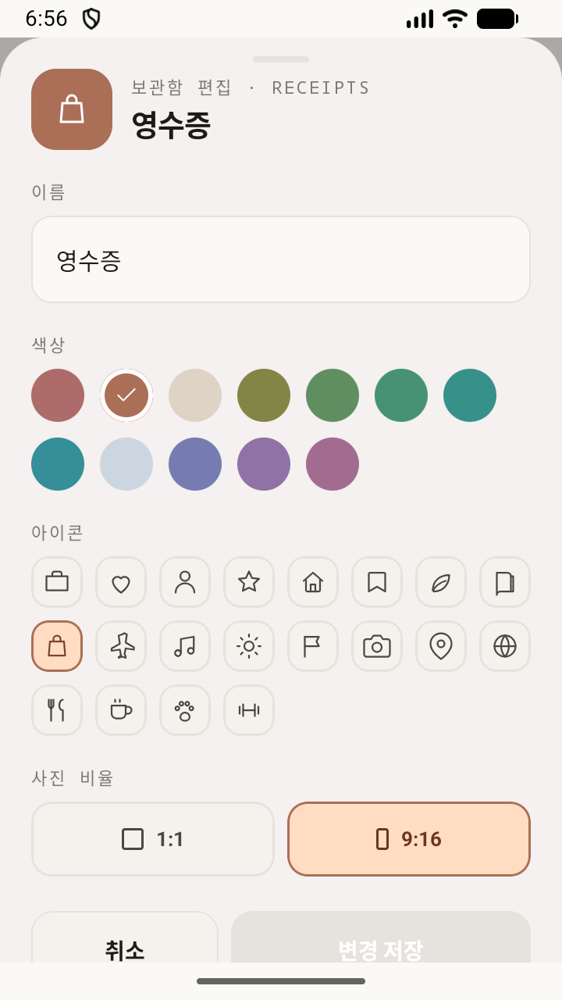
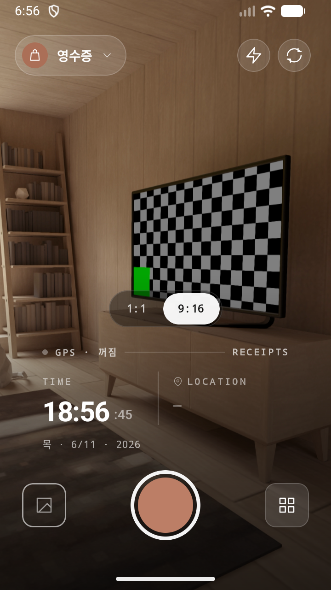
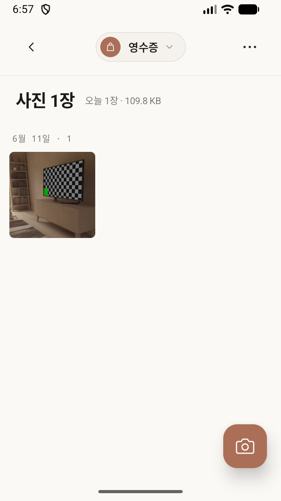
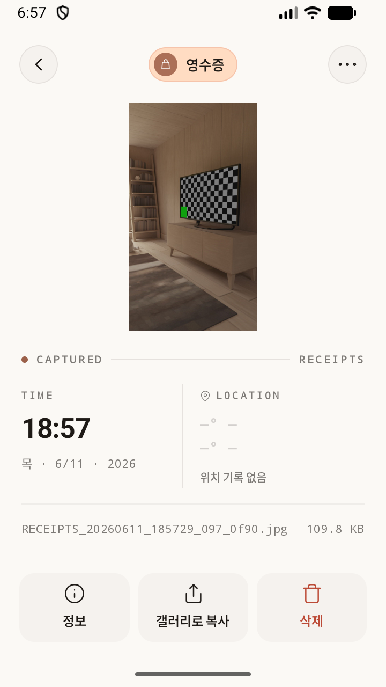
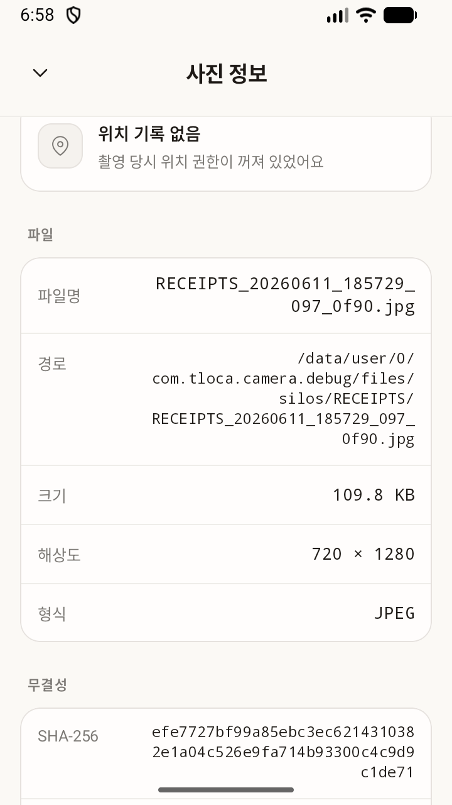
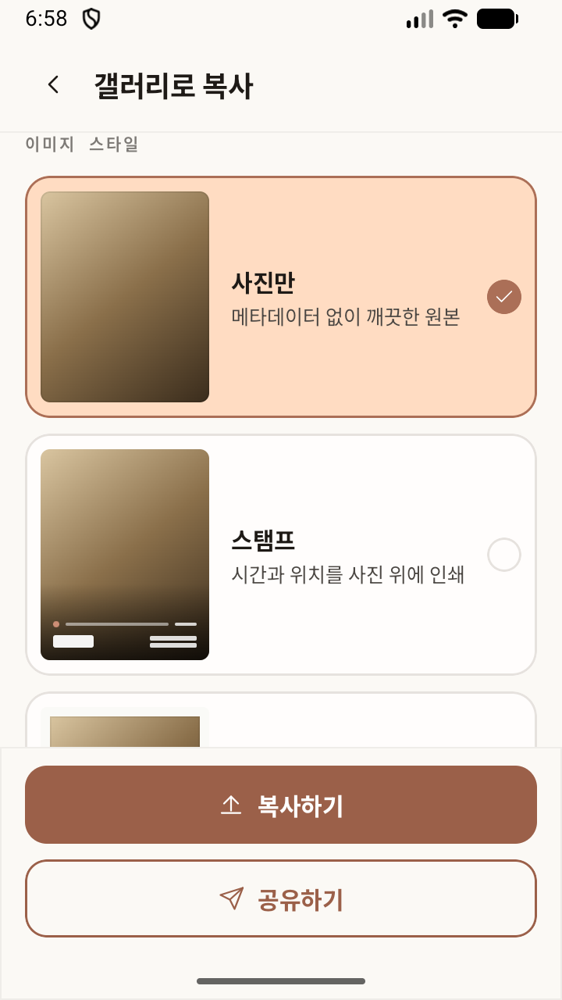
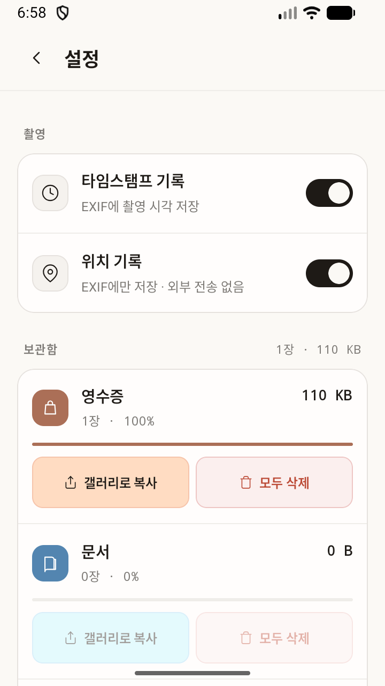

# T-Loca 사용자 매뉴얼

버전: 0.1.2

T-Loca는 사진을 찍기 전에 보관함을 먼저 고르는 카메라 앱입니다. 촬영한 사진은 선택한 보관함 안에만 저장되며, 기기 갤러리에는 자동으로 노출되지 않습니다.

## 시작하기

앱을 처음 열면 T-Loca가 사진을 보관함별로 분리하고, 촬영 정보와 선택한 위치 정보를 메타데이터로 남길 수 있으며, 사진은 앱 내부에 저장된다는 점을 안내합니다.

카메라 권한은 촬영에 필요합니다. 위치 권한은 선택 사항이며, 허용하면 촬영 당시 위치가 사진 정보와 EXIF에 기록됩니다. 위치 정보는 앱 설명 기준으로 외부로 전송되지 않습니다.

## 보관함 선택하기

첫 화면에서 사진을 저장할 보관함을 고릅니다. 기본 보관함은 영수증, 문서, 일상입니다. 보관함을 누르면 카메라 화면으로 이동하고, 촬영한 사진은 선택한 보관함에만 저장됩니다.

## 보관함 만들기와 편집하기

보관함 선택 화면에서 보관함 추가를 눌러 새 보관함을 만들 수 있습니다. 빠른 시작 칩을 사용하면 데일리룩, 맛집, 카페, 여행, 운동, 반려동물, 셀카, 챌린지, 일상, 공부 같은 목적별 보관함을 빠르게 시작할 수 있습니다.

보관함 이름, 색상, 아이콘, 사진 비율을 설정할 수 있습니다. 보관함은 최대 10개까지 만들 수 있고 마지막 보관함은 삭제할 수 없습니다. 보관함 삭제 전에 사진을 보관하려면 갤러리로 먼저 복사하기를 사용하세요.

## 사진 촬영하기

카메라 화면에서는 선택한 보관함에 바로 사진을 저장합니다. 셔터 버튼을 눌러 촬영하고, 플래시, 카메라 전환, 1:1 또는 9:16 촬영 비율, 위치 기록, 탭 포커스를 사용할 수 있습니다.

## 갤러리 보기

갤러리는 현재 선택한 보관함의 사진만 보여줍니다. 사진은 날짜별로 묶여 표시되며, 상단에서 전체 사진 수와 오늘 촬영한 사진 수를 확인할 수 있습니다.

## 사진 상세와 정보 확인하기

사진 상세 화면에서는 사진을 크게 보고, 삭제, 갤러리로 복사, 정보 확인을 실행할 수 있습니다. 삭제한 사진은 복구할 수 없습니다.

사진 정보 화면에는 촬영 날짜와 시간, 표준 시간대, 좌표와 주소, 파일명과 내부 경로, 파일 크기, 해상도, 형식, SHA-256 해시와 계산 시각이 표시됩니다.

## 갤러리로 복사하고 공유하기

T-Loca의 사진은 기본적으로 앱 내부에만 있습니다. 다른 앱에서 보거나 클라우드 백업 대상에 포함하려면 갤러리로 복사를 실행해야 합니다. 복사된 사진은 `DCIM/T-Loca` 위치에 저장됩니다.

복사할 때 사진만, 스탬프, 보더 스타일을 선택할 수 있습니다. 공유하기를 사용할 수도 있고, 인증 정보 포함 옵션을 켜면 SHA-256 해시, 위치, 시간 정보가 포함된 배너를 추가합니다.

## 설정 사용하기

설정 화면에서는 촬영 설정, 내부 저장소 사용량, 보관함별 사용량, 보관함별 갤러리 복사, 보관함별 모두 삭제, 모두 갤러리로 복사, 모든 데이터 삭제를 관리합니다.

## 데이터 보관 주의사항

T-Loca의 기본 저장 원칙은 앱 내부 저장입니다. 앱 내부 사진은 기기 갤러리에 자동으로 나타나지 않고, 앱을 삭제하거나 Android 설정에서 앱 데이터를 지우면 사진이 삭제될 수 있습니다. 중요한 사진은 먼저 갤러리로 복사하세요.

## 문제 해결

카메라가 열리지 않으면 Android 앱 설정에서 T-Loca의 카메라 권한을 허용했는지 확인하세요. 위치가 기록되지 않으면 위치 권한과 설정의 위치 기록이 켜져 있는지 확인하세요. 사진이 기기 갤러리에 보이지 않으면 갤러리로 복사를 실행하세요. 저장 공간 부족 안내가 표시되면 기기 저장 공간을 확보한 뒤 촬영하세요.
